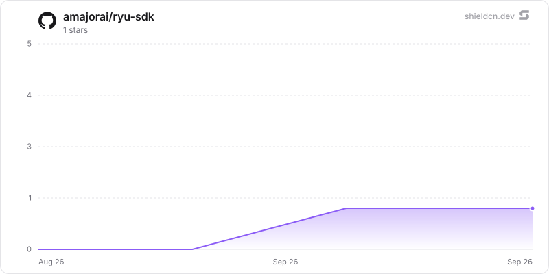

# Ryu SDK

> Libraries for calling Ryu, plus the authoring SDK for building Ryu plugins and apps.

<p>
  <a href="https://github.com/amajorai/ryu-sdk"></a>
  <a href="https://github.com/amajorai/ryu-sdk/releases"></a>
  <a href="https://github.com/amajorai/ryu-sdk/actions/workflows/ci.yml"></a>
  <a href="https://github.com/amajorai/ryu-sdk/blob/main/LICENSE"></a>
  <a href="https://docs.ryuhq.com/docs/extend/develop/sdk"></a>
</p>

<p>
  <a href="https://www.npmjs.com/package/@ryuhq/sdk"></a>
  <a href="https://www.npmjs.com/package/@ryuhq/client"></a>
  <a href="https://www.npmjs.com/package/@ryuhq/core-client"></a>
  <a href="https://www.npmjs.com/package/@ryuhq/protocol"></a>
  <a href="https://www.npmjs.com/package/create-ryu-app"></a>
  <a href="https://www.npmjs.com/package/@ryuhq/sdk-native"></a>
</p>

<p>
  <a href="https://crates.io/crates/ryu-kernel-contracts"></a>
  <a href="https://crates.io/crates/ryu-sdk"></a>
  <a href="https://crates.io/crates/ryu-sdk-ffi"></a>
  <a href="https://crates.io/crates/ryu-sdk-uniffi"></a>
</p>

<p>
  <a href="https://pypi.org/project/ryu-sdk/"></a>
  <a href="https://www.nuget.org/packages/Ryu.Sdk"></a>
  <a href="https://central.sonatype.com/artifact/com.ryu/ryu-client"></a>
</p>

This repository has two different things. Pick the one that matches your job:

| You are building... | Use this | Install/use it as... |
|---|---|---|
| A Ryu plugin, app, tool, workflow, or skill | [`@ryuhq/sdk`](./packages/sdk) | TypeScript authoring SDK and `ryu` CLI |
| A TypeScript or React Native app that embeds chat | [`@ryuhq/client`](./packages/client) | npm package; HTTP + streaming chat |
| A TypeScript or React Native app that manages Core | [`@ryuhq/core-client`](./packages/core-client) | npm package; typed Core/Gateway domain calls |
| A Java app that calls Core | [`com.ryu:ryu-client`](./bindings/java) | Java 17 Maven Central library |
| A Rust app that needs the shared kernel | [`ryu-sdk`](./crates/sdk/core) | crates.io Rust crate |
| A C or Go app that needs the shared kernel | [`ryu-sdk-ffi`](./crates/sdk/ffi) | C ABI; Go uses cgo |
| A Python app that needs the shared kernel | [`ryu-sdk`](https://pypi.org/project/ryu-sdk/) | PyPI platform wheel |
| A C# app that needs the shared kernel | [`Ryu.Sdk`](https://www.nuget.org/packages/Ryu.Sdk) | NuGet package with native assets |
| A Swift or Kotlin app that needs the shared kernel | [`ryu-sdk-uniffi`](./crates/sdk/uniffi) | generated source binding from this hub |

For most application developers, start with a client library. The generated
Rust bindings are the lower-level path for manifest validation, Gateway-routed
model calls, and embeddings; they are not a replacement for a Core client.

## TypeScript or React Native

Install the lightweight chat library:

```bash
npm install @ryuhq/client
```

```typescript
import { createRyuClient, type RyuFetch } from "@ryuhq/client";

const client = createRyuClient({
  baseUrl: "http://127.0.0.1:7980",
  token: process.env.RYU_TOKEN,
});

const agents = await client.agents.list();
const reply = await client.agents.run(
  agents[0].id,
  [{ role: "user", content: "Hello from my app." }],
);
```

For Expo streaming, pass `expo/fetch`:

```tsx
import { fetch as expoFetch } from "expo/fetch";
import { createRyuClient } from "@ryuhq/client";

const client = createRyuClient({
  baseUrl: "http://192.168.1.10:7980",
  token: nodeToken,
  fetch: expoFetch as RyuFetch,
});
```

Use `@ryuhq/core-client` instead when the app needs typed agents, models,
plugins, skills, MCP servers, Spaces, workflows, or Gateway settings. It takes
the same target shape, `{ url, token, fetch }`. Store tokens in secure storage;
never ship a provider API key in a mobile bundle.

## Python

Install the platform wheel:

```bash
python -m pip install ryu-sdk==0.3.0
```

```python
import ryu_sdk

ryu_sdk.validate_plugin_id("io.example.plugin")
```

The wheel carries the generated UniFFI module and the native library for the
published Linux x64, macOS x64/arm64, and Windows x64 targets.

## C#

Install the generated binding and its platform-native assets:

```bash
dotnet add package Ryu.Sdk --version 0.3.0
```

## Java

Install the Java library from Maven Central:

```xml
<dependency>
  <groupId>com.ryu</groupId>
  <artifactId>ryu-client</artifactId>
  <version>0.3.0</version>
</dependency>
```

For an unreleased checkout, use `mvn install` from `bindings/java`.

Then call Core with normal Java types:

```java
import com.ryu.sdk.RyuClient;
import java.net.URI;
import java.util.List;

try (var ryu = new RyuClient(
    URI.create("http://127.0.0.1:7980"),
    System.getenv("RYU_TOKEN"))) {
  var agent = ryu.listAgents().get(0);
  var reply = ryu.run(
      agent.id(),
      List.of(RyuClient.Message.user("Summarize today's tasks.")));
  System.out.println(reply);
}
```

The library handles Core HTTP and SSE. It does not require UniFFI, a Rust
toolchain, or provider credentials. See [`bindings/java/README.md`](./bindings/java/README.md)
for streaming, conversations, and Spaces.

## Authoring a Ryu plugin or app

Use the TypeScript SDK when you are creating something that Ryu installs or
runs:

```bash
npm install @ryuhq/sdk
npx create-ryu-app my-plugin
```

`@ryuhq/sdk` provides `defineAgent`, `defineWorkflow`, `defineTool`,
`defineSkill`, and `defineAction`, plus manifest validation and the `ryu pack`
CLI. Every model call is routed through the Ryu Gateway.

## Kernel bindings

The `crates/sdk/*` directories contain the shared Rust implementation and its
native adapters. The `bindings/*` directories contain target-language package
builds, examples, and tests. They are useful when your application must call
the Rust kernel directly; they are not required for ordinary Core API access.

```bash
# Build the shared kernel and run its tests.
cargo test --workspace --locked --all-targets

# Run one generated binding project.
bash bindings/python/test.sh
bash bindings/kotlin/test.sh
```

Generated binding files are build outputs. Do not hand-edit them; change the
Rust export and regenerate the target package.

## Documentation and releases

The [SDK guide](https://docs.ryuhq.com/docs/extend/develop/sdk) explains the
library choices and API contracts. The [language-binding guide](https://docs.ryuhq.com/docs/extend/develop/sdk/language-bindings)
covers the lower-level Rust kernel adapters. The [publishing guide](https://docs.ryuhq.com/docs/extend/develop/sdk/publishing)
explains the versioned release train.

The hub is synchronized from the Ryu monorepo. Pull requests are welcome;
accepted changes are ported to the canonical source before a later sync.

## License

Apache-2.0. See [LICENSE](./LICENSE).


## Star History

<a href="https://github.com/amajorai/ryu-sdk/stargazers">
  <picture>
    <source media="(prefers-color-scheme: dark)" srcset="./.github/shieldcn/star-chart-dark.svg" />
    
  </picture>
</a>
